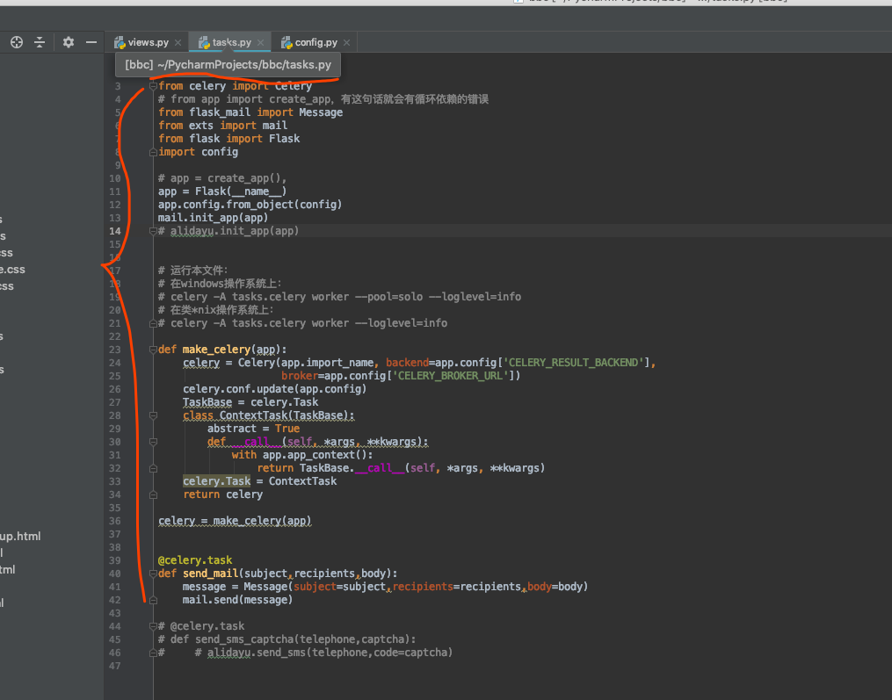
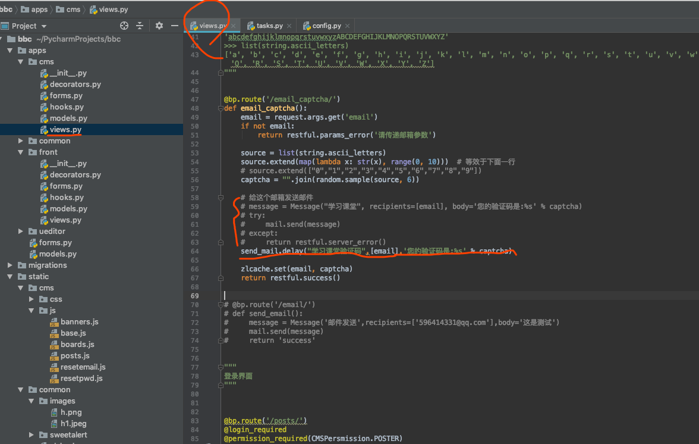
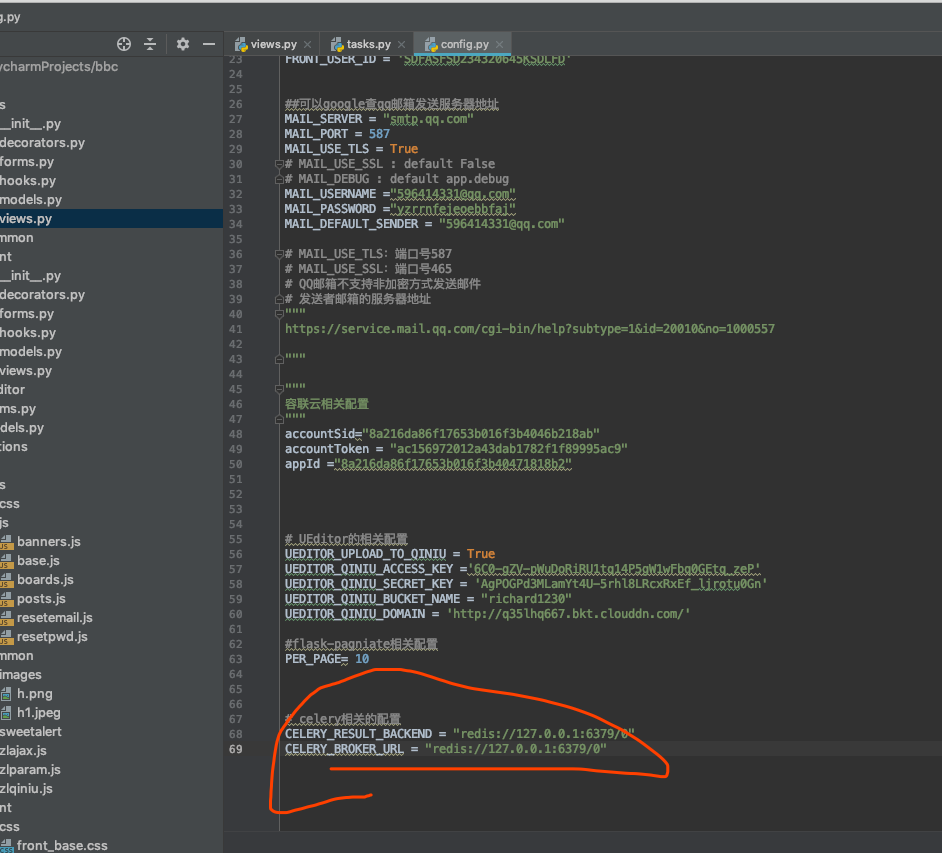
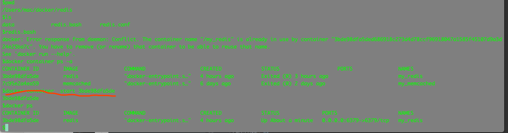
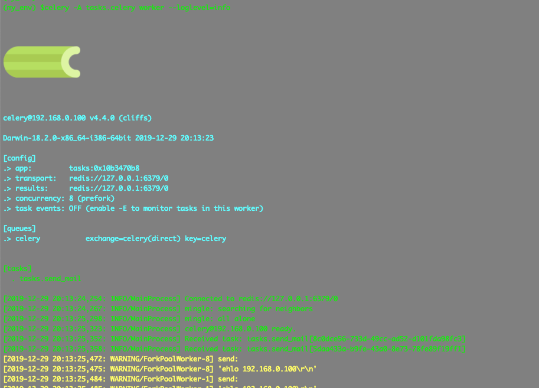
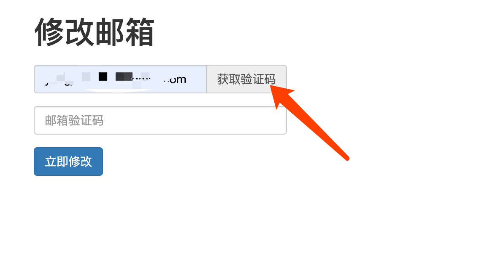

[TOC]













```
(my_env) $celery -A tasks.celery worker --loglevel=info


celery@192.168.0.100 v4.4.0 (cliffs)

Darwin-18.2.0-x86_64-i386-64bit 2019-12-29 20:13:23

[config]
.> app: tasks:0x10b3470b8
.> transport: redis://127.0.0.1:6379/0
.> results: redis://127.0.0.1:6379/0
.> concurrency: 8 (prefork)
.> task events: OFF (enable -E to monitor tasks in this worker)

[queues]
.> celery exchange=celery(direct) key=celery


[tasks]
  . tasks.send_mail

[2019-12-29 20:13:24,254: INFO/MainProcess] Connected to redis://127.0.0.1:6379/0
[2019-12-29 20:13:24,267: INFO/MainProcess] mingle: searching for neighbors
[2019-12-29 20:13:25,298: INFO/MainProcess] mingle: all alone
[2019-12-29 20:13:25,323: INFO/MainProcess] celery@192.168.0.100 ready.
[2019-12-29 20:13:25,352: INFO/MainProcess] Received task: tasks.send_mail[8c0dce56-733d-49cc-ad52-d101fda98fc3]
[2019-12-29 20:13:25,358: INFO/MainProcess] Received task: tasks.send_mail[5daa433a-b9fe-43a0-8e73-78fe89f19ff1]
[2019-12-29 20:13:25,472: WARNING/ForkPoolWorker-8] send:
[2019-12-29 20:13:25,475: WARNING/ForkPoolWorker-8] 'ehlo 192.168.0.100\r\n'
[2019-12-29 20:13:25,484: WARNING/ForkPoolWorker-1] send:
[2019-12-29 20:13:25,485: WARNING/ForkPoolWorker-1] 'ehlo 192.168.0.100\r\n'
[2019-12-29 20:13:25,572: WARNING/ForkPoolWorker-8] reply:
[2019-12-29 20:13:25,572: WARNING/ForkPoolWorker-8] b'250-smtp.qq.com\r\n'
```
运行程序主程序;
而后:

即可发现邮件到达!
